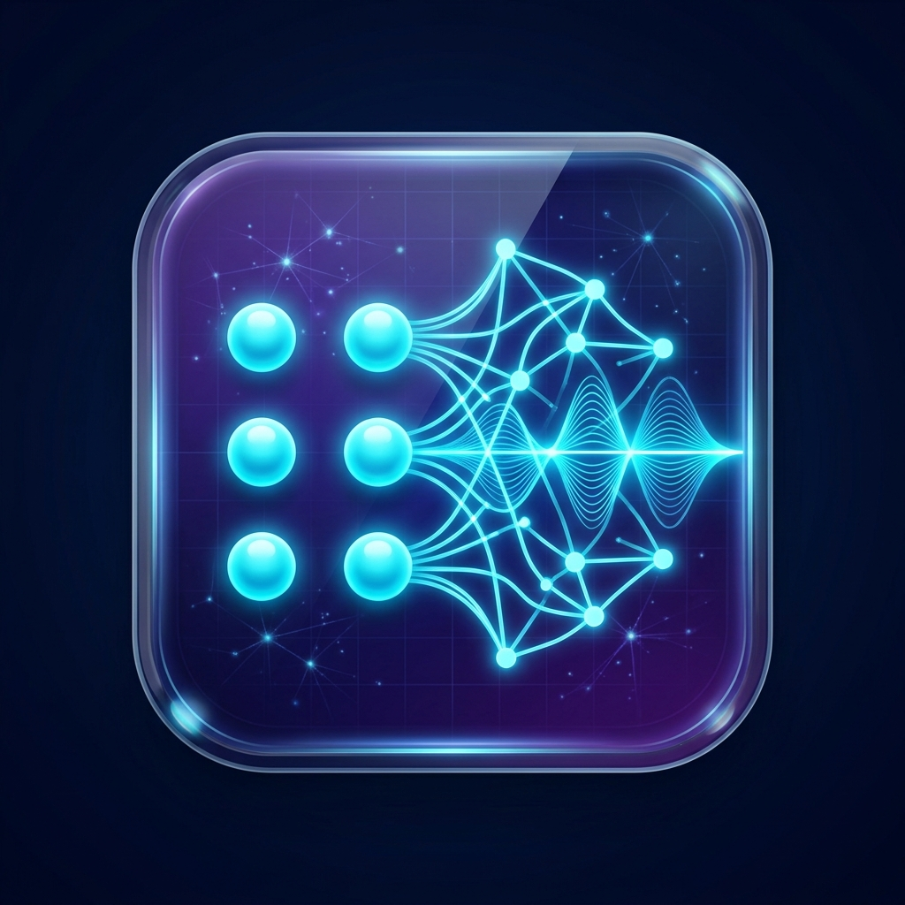
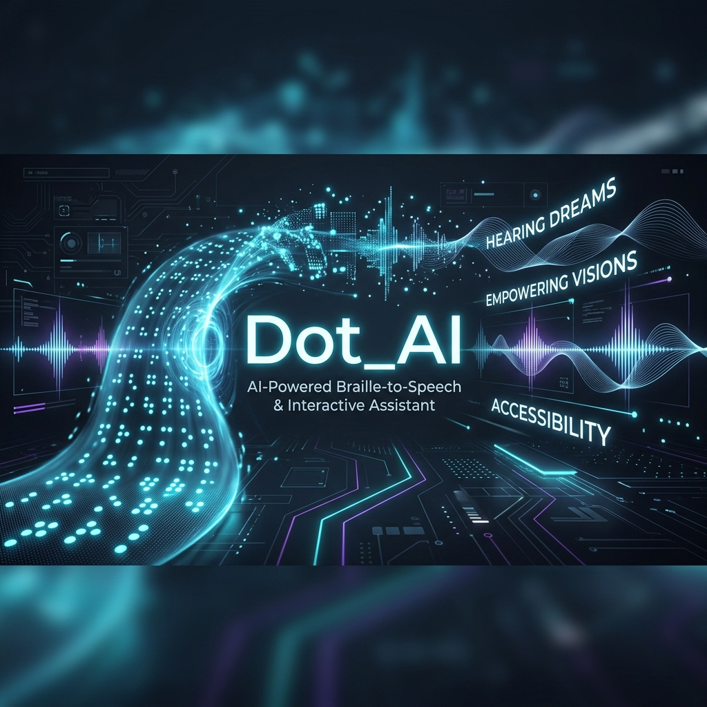
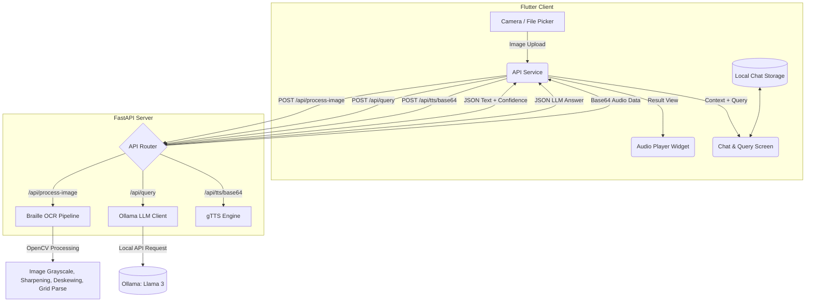

#  Dot_AI

[](https://fastapi.tiangolo.com/)
[](https://flutter.dev/)
[](https://opencv.org/)
[](https://ollama.com/)
[](LICENSE)

An AI-powered system designed to bridge the gap between physical Braille documents and modern digital accessibility. **Dot_AI** allows users to scan Braille sheets, translate them into digital text in real-time, generate human-like text-to-speech audio, and engage in context-aware conversations with a local Large Language Model (LLM) about the scanned content.

---



---

## 🌟 Key Features

*   **Custom Computer Vision Braille OCR**:
    *   **Blur Recovery**: Employs custom 2D sharpening filters to restore blurry camera captures.
    *   **Scale-Invariant Adaptive Thresholding**: Automatically adjusts window sizing to adapt to variable resolutions and close-up crops.
    *   **Dynamic Mathematical Deskewing (Tilt Correction)**: Evaluates vector angles between contours using local K-Nearest Neighbors (KNN) histograms to automatically calculate and apply anti-rotation transformations.
    *   **Grid Spacing Resolution**: Determines dot spacing mathematically using median nearest-neighbor distances, resolving dot columns/rows dynamically without pre-fixed grids.
*   **Context-Aware Chatbot (Ollama Integration)**:
    *   Uses a locally hosted LLM (e.g., Llama 3) via Ollama.
    *   Translates, summarizes, explains, or explores concepts from the scanned Braille text.
    *   Maintains multi-turn conversation history.
    *   Robust handling of transcription noise (auto-correcting minor typos during chat processing).
*   **High-Quality Text-to-Speech (TTS)**:
    *   Synthesizes the translated text into spoken audio files.
    *   Encodes audio into base64 format for high-speed transmission and local playback.
*   **Stunning Mobile Client (Flutter)**:
    *   Premium modern UI featuring a sleek **dark theme** with glowing accents and glassmorphism.
    *   Dynamic, custom-animated splash screen.
    *   Flexible page routing and sliding widgets.
    *   Interactive chat drawer for managing previous conversation sessions.
    *   Built-in media player with progress control to listen to translated text on-the-go.

---

## 🏗️ System Architecture

The ecosystem splits responsibilities between a Dart/Flutter mobile application and a FastAPI Python backend server:



---

## 📂 Repository Structure

```text
├── Dot_AI/
│   ├── backend/                      # FastAPI Python Backend
│   │   ├── braille_ocr/              # Computer Vision OCR Engine
│   │   │   ├── __init__.py
│   │   │   └── pipeline.py           # Main OpenCV processing, deskewing & mapping logic
│   │   ├── routes/                   # FastAPI Endpoints
│   │   │   ├── image_routes.py       # Image translation route
│   │   │   ├── query_routes.py       # LLM chat and query route
│   │   │   └── tts_routes.py         # Text-to-speech route
│   │   ├── services/                 # Core Backend Services
│   │   │   ├── braille_service.py    # Braille OCR logic integration
│   │   │   ├── ollama_service.py     # Local Ollama client & history manager
│   │   │   └── tts_service.py        # gTTS audio generation
│   │   ├── main.py                   # API Entrypoint
│   │   └── requirements.txt          # Python dependencies
│   │
│   ├── flutter_app/                  # Flutter Mobile Frontend
│   │   ├── assets/                   # Image assets (Logo, Launcher icons)
│   │   ├── lib/
│   │   │   ├── main.dart             # App Entrypoint
│   │   │   ├── models/               # Data structures (Chat messages, etc.)
│   │   │   ├── screens/              # App Screens (Home, Result, Chat, Splash)
│   │   │   ├── services/             # Http API communication & local storage
│   │   │   ├── theme/                # Custom Theme Configuration
│   │   │   └── widgets/              # Reusable UI elements (Drawer, Chat Bubbles, etc.)
│   │   └── pubspec.yaml              # Dart dependencies & assets
│
└── docs/
    └── images/                       # Documentation assets
```

---

## 🛠️ Installation & Setup

### 1. Prerequisites
*   [Flutter SDK](https://docs.flutter.dev/get-started/install) (v3.0.0+)
*   [Python 3.10+](https://www.python.org/downloads/)
*   [Ollama](https://ollama.com/) (For local LLM querying)

---

### 2. Backend Installation

1.  Navigate to the backend directory:
    ```bash
    cd Dot_AI/backend
    ```
2.  Create a virtual environment (optional but recommended):
    ```bash
    python -m venv venv
    # Windows activation:
    .\venv\Scripts\activate
    # macOS/Linux activation:
    source venv/bin/activate
    ```
3.  Install dependencies:
    ```bash
    pip install -r requirements.txt
    ```
4.  **Set up Ollama**:
    *   Download and run Ollama on your system.
    *   Pull the target model (Llama 3 is recommended, or Llama 3.2 for lower resource machines):
        ```bash
        ollama pull llama3
        ```
    *   Ensure Ollama is running in the background (default port `11434`).
5.  Start the FastAPI server:
    ```bash
    python main.py
    # OR
    uvicorn main:app --host 0.0.0.0 --port 8000 --reload
    ```
    The backend will start running at `http://localhost:8000`. You can visit `http://localhost:8000/docs` to view the interactive Swagger API documentation.

---

### 3. Frontend Installation

1.  Navigate to the flutter_app directory:
    ```bash
    cd Dot_AI/flutter_app
    ```
2.  Configure your server connection:
    Open [lib/services/api_service.dart](file:///c:/Users/negha/OneDrive/Desktop/mini_project_real/Dot_AI/flutter_app/lib/services/api_service.dart#L15) and update the `kBaseUrl` to match your backend IP address:
    *   *Local Dev / Desktop target*: `http://127.0.0.1:8000/api`
    *   *Android Emulator*: `http://10.0.2.2:8000/api`
    *   *Physical Mobile Device*: `http://YOUR_PC_IP:8000/api` (Ensure your phone and PC are on the same Wi-Fi network).
3.  Fetch the Flutter packages:
    ```bash
    flutter pub get
    ```
4.  Run the application:
    ```bash
    flutter run
    ```

---

## 🔍 OpenCV OCR Processing Breakdown

The custom Braille OCR algorithm operates in a structured pipeline inside [pipeline.py](file:///c:/Users/negha/OneDrive/Desktop/mini_project_real/Dot_AI/backend/braille_ocr/pipeline.py):

```
[ Uploaded Image ] 
        │
        ▼
[ Grayscale & Padding ] ──► Extends borders to protect edge-dots from cropping artifacting.
        │
        ▼
[ Sharpening filter ]  ──► Applies 2D high-pass convolution kernel to eliminate camera blur.
        │
        ▼
[ Adaptive Threshold ] ──► Gaussian local thresholding adjusts dynamically to varying lighting.
        │
        ▼
[ Morphological Open ] ──► Eliminates random paper fibers, noise, and speckles.
        │
        ▼
[ Contour Detection ]  ──► Bounding box extraction and area/aspect ratio filters isolated dots.
        │
        ▼
[ Deskewing System ]   ──► Detects skew angle using KNN nearest-neighbor delta-axes histograms 
        │                  and applies anti-rotation transforms.
        │
        ▼
[ Grid Map Resolution ]──► Computes median distance between nearest neighbors, mapping cell 
        │                  dimensions to translate dots into 6-bit binary Braille grids.
        │
        ▼
[ Unicode Conversion ] ──► Converts binary arrays into corresponding Unicode Braille/English text.
```

---

## 🤝 Contributing

Contributions are welcome! Please feel free to open issues or submit pull requests to improve the computer vision detection pipeline, add language translation dictionaries, or introduce design upgrades to the mobile interface.

---

## 📄 License

This project is licensed under the MIT License. See the [LICENSE](LICENSE) file for details.